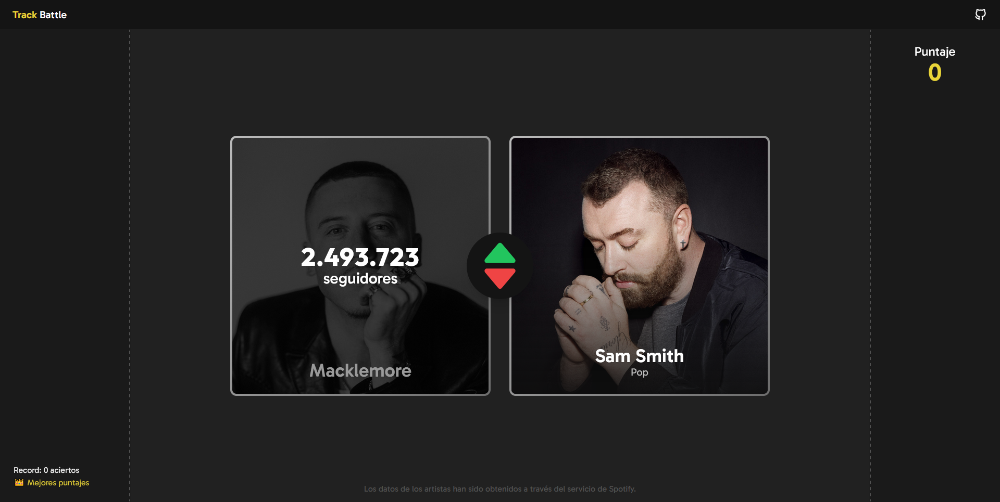
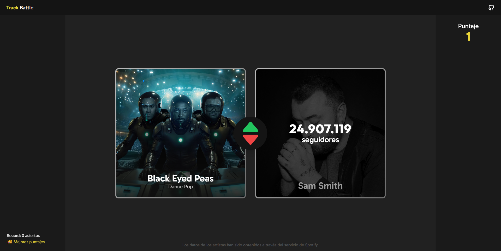
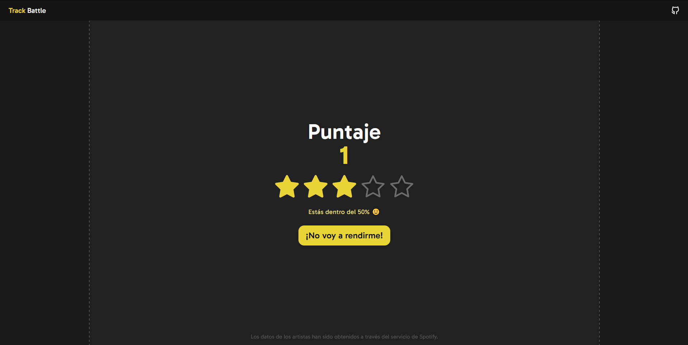

# 💽 Track Battle

Game based on Higher or Lower, using music artists.

## Features:

- 👨🏻‍🎤 Over 800 artists.
- 💯 High score.
- ⭐ Star rating based on all players's scores.
- 📖 Access to Wikipedia articles for almost all artists.
- 🌠 Fancy animations.
- 📱 Responsiveness.

## How to play:

The game is very simple.

1. Click on the _green up arrow_ if you think the artist who isn't showing the followers has **MORE** followers.
   Otherwise, click on the _red down arrow_ if you think the artist who isn't showing the followers has **LESS** followers.

2. If you guessed, you'll see a check animation and a new artist will show up 😄.

3. If you didn't, you'll see a game over screen, showing your score.

Aditionally, you can click on the artist's name to see their Wikipedia article.

---

To avoid cheating, data files are not available in this repo.

_Game made by Manuel Seitz_
